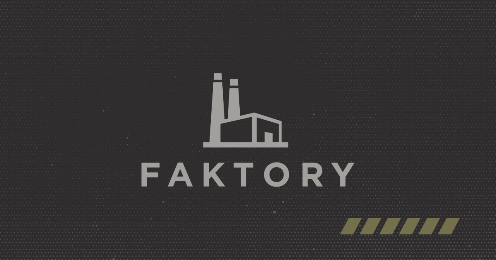

# Faktory

Faktory is a partner agency here in the Salt Lake area. We collaborated with their design and content teams to build a custom site that matched their brand, with easy editing and customization using Sanity's CMS powered by a lightning fast Next.js frontend.

## Production URLs

- Public site: https://faktory.vercel.app/
- CMS: https://faktory-studio.vercel.app/

## Structure

- `./studio/`: Sanity Studio for editing content
- `./web/`: Public Next.js site

## Quick start

1. Clone this repository
2. `npm install` in the project root folder on local
3. `npm run dev` to start the studio and frontend locally
   - Your studio should be running on [http://localhost:3333](http://localhost:3333)
   - Your frontend should be running on [http://localhost:3000](http://localhost:3000)
4. `npm run build` to build to production locally

## Deploy changes

Vercel automatically deploys new changes committed to the repo.
